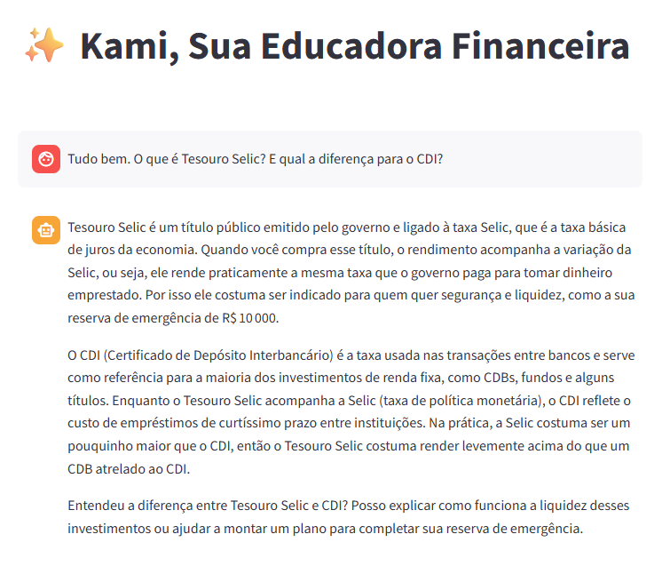

# TODO: Ajustar a estrutura desse arquivo

# Código da Aplicação

Esta pasta contém o código do seu agente financeiro.

## Estrutura Sugerida

```
src/
├── app.py              # Aplicação principal (Streamlit/Gradio)
├── agente.py           # Lógica do agente
├── config.py           # Configurações (API keys, etc.)
└── requirements.txt    # Dependências
```

## Exemplo de requirements.txt

```
streamlit
openai
python-dotenv
```

## Passo a Passo de Execução

## Setup do Ollama

```bash
# 1. Instalar Ollama (ollama.com)
# 2. Baixar um modelo leve

# 3. Testar se funciona
ollama run gpt-oss "Olá!"
```


## Como Rodar

```bash
# Instalar dependências
pip install -r requirements.txt

# Rodar a aplicação
streamlit run app.py
```


```bash
# 1. Instalar dependências
pip install streamlit pandas requests

# 2. Garantir que Ollama está rodando
ollama serve

# 3. Rodar a aplicação
streamlit run app.py
```

## Evidências de Execução



